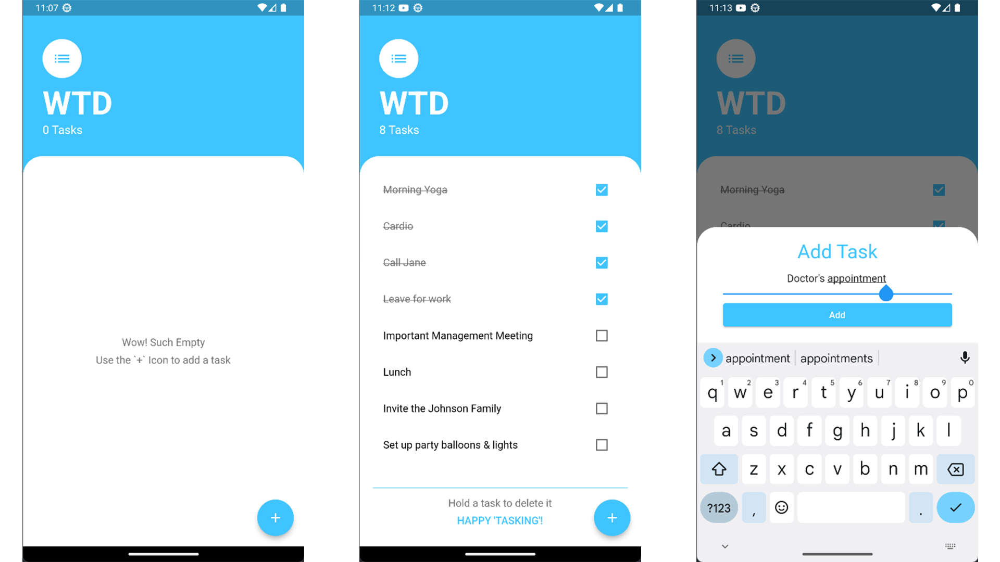

# WTD - What To Do

A cross-platform tasklist application, made with Flutter, with persistent data storage.

## 📱 Screenshots


## ❓How to Use

### Pre-requisites

- **Flutter** is installed and added to `PATH`

### Steps to Follow
- Get the packages, in your terminal, execute -
  ```
  flutter clean
  flutter pub get
  ```
- That's it, you can now run it!
  ```
  flutter run
  ```

## 🤝 Contributing

Contributions are always welcome!

See the [Contribution Guide](contributing.md) for ways to get started.

## 🤩 Inspired By

This project was inspired by Angela Yu's `Todoey` Flutter application, which was demonstrated in her course [The Complete 2021 Flutter Development Bootcamp with Dart](https://www.udemy.com/course/flutter-bootcamp-with-dart/) on Udemy.

This app deals with a crucial aspect that the `Todoey` app missed, which is, user data persistence. This app stores the data using the Flutter SharedPreferences package, thus making it available throughout every launch on the device.

## 💡 Authors

- [@Anikate De](https://www.github.com/Anikate-De)

## 📝 License

Copyright © 2022-present, Anikate De

This project is licensed under [Apache License 2.0](LICENSE)